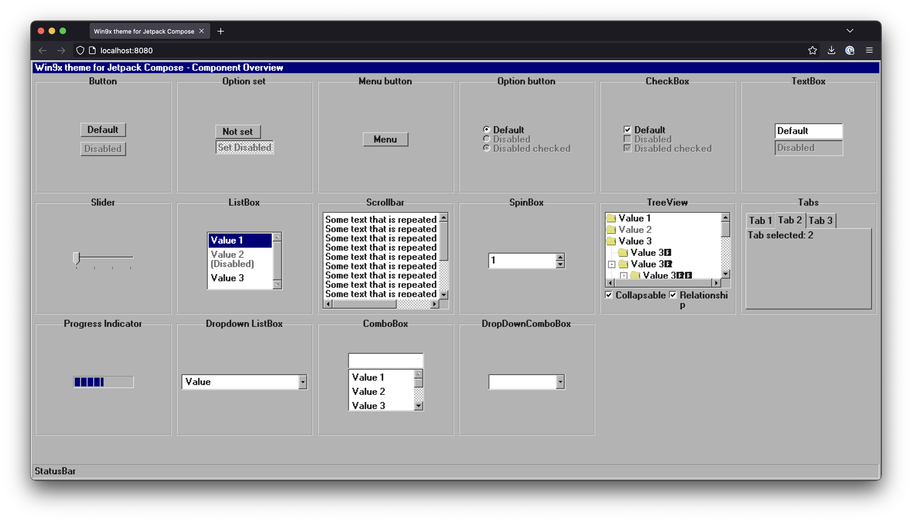
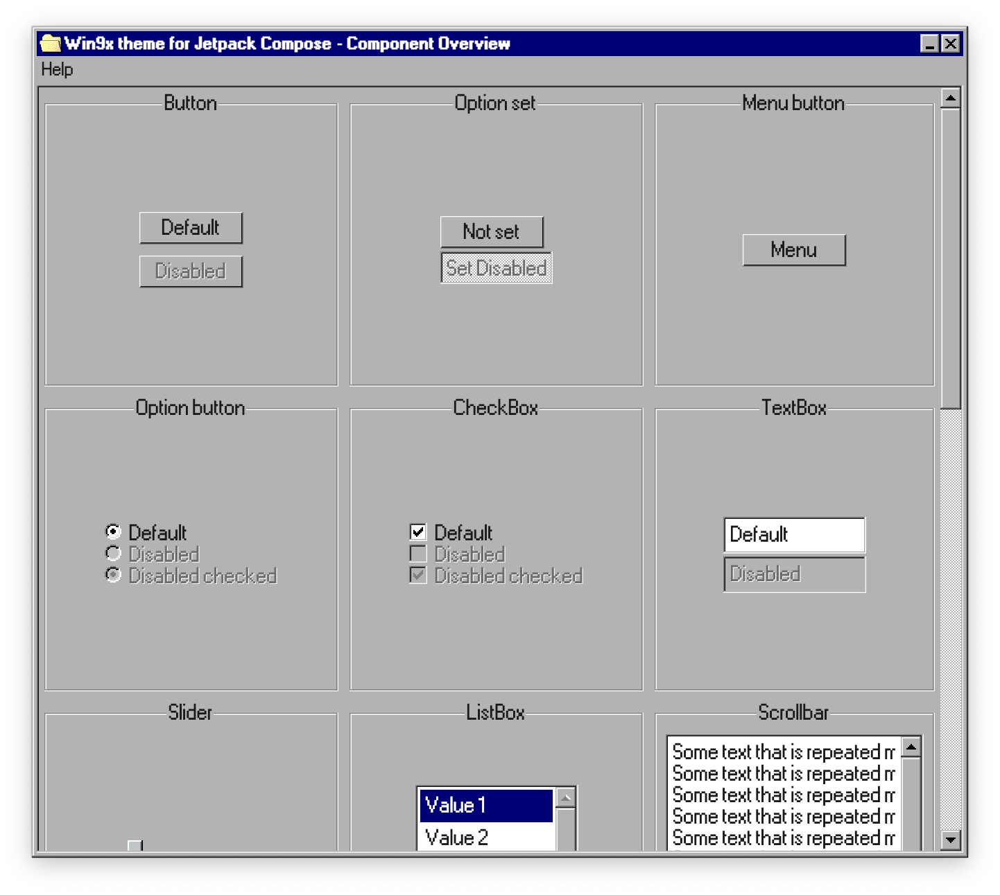
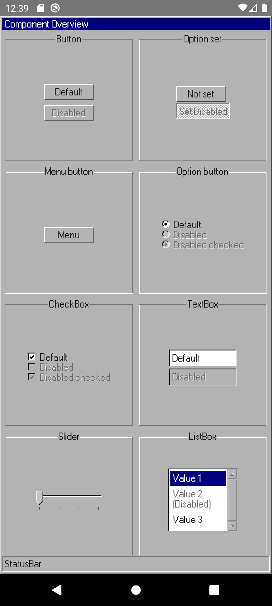

# Win9x Theme for Jetpack Compose UI

Welcome to **Win9x Theme for Jetpack Compose UI**, a distinctive and self-contained theme engineered
exclusively for Jetpack Compose UI. This project diverges from the standard Material Design paradigm
by offering a comprehensive suite of custom-built components that are intricately woven from Jetpack
Compose primitives.

## Features

- **Standalone Components**: Each component is independently designed, eliminating dependencies on
  the Material Design theme, and ensuring extensive customization options.
- **Multiplatform Compatibility**: With targets set for JVM, Android, and JSWasm, the theme is
  prepared for versatile deployment across various platforms. However, the primary emphasis is on
  the JVM target, with iOS compatibility forthcoming.
- **Development Stage**: Currently in its pre-release stage, the project acknowledges that it may
  include breaking changes until reaching version 1.0.0. Early adopters are encouraged to experiment
  and offer valuable feedback.

## Live demo

For a glimpse of the `win9x-theme` library in action, visit the live JSWasm demo
at http://win9x-compose.ncaj.nl/. Please note that the JSWasm demo is experimental and does not
fully represent the capabilities of the JVM target.

## Screenshots

<table>
  <tr>
    <td >JS Wasm</td>
    <td >JVM</td>
  </tr>
  <tr>
    <td ></td>
    <td ></td>
  </tr>
  <tr>
    <td >Android</td>
  </tr>
  <tr>
    <td ></td>
  </tr>
</table>

## Getting Started

Integration into a Jetpack Compose project is straightforward:

### Step 1: Adding the Repository

First, you need to add the repository that hosts the `win9x-theme` library to your
project's `build.gradle.kts` file. Replace `VERSION` with the current version of the library.
Make sure you configure [authentication properly](https://docs.github.com/en/packages/working-with-a-github-packages-registry/working-with-the-gradle-registry#authenticating-to-github-packages).

```kotlin
repositories {
    maven(url = "https://maven.pkg.github.com/nassendelft/compose-win9x-theme")
}
```

### Step 2: Adding the Dependency

Next, add the `win9x-theme` library as a dependency in your module's `build.gradle` file:

```kotlin
dependencies {
    implementation("nl.ncaj.theme.win9x:win9x-theme:VERSION")
}
```

### Step 3: Sync Project

After adding the repository and dependency, sync your project with the Gradle files. This will
download the library and make it available for use in your project.

### Step 4: Importing and Using the Library

Now, you can import and use the `win9x-theme` library in your Kotlin code:

```kotlin
import androidx.compose.ui.window.application
import nl.ncaj.theme.win9x.Win9xTheme
import nl.ncaj.theme.win9x.controls.Window

fun main() = application {
    Win9xTheme {
        Window(
            title = "Win9x theme for Jetpack Compose",
            onCloseRequested = ::exitApplication,
        ) {
            // your content
        }
    }
}
```

## Available components

### Button

The Button control represents a clickable button that triggers an action when interacted with.

Usage example:

```kotlin
Button(onClick = { /* Handle click */ }) {
    Text("Click Me")
}
```

### Option Set

An OptionSet is a collection of mutually exclusive options, rendered as radio buttons

Usage example:

```kotlin
var set by remember { mutableStateOf(false) }
OptionSetButton(set, onSetChanged = { set = it })
```

### Menu Button

A MenuButton displays a menu when clicked, allowing users to select from multiple options.

Usage example:

```kotlin
MenuButton(
    menu = {
        label("Command") {}
        divider()
        cascade("Check Box") {
            label("Command") {}
        }
    }
) {
    Text("Menu")
}
```

### Option Button

An OptionButton is a toggleable button that can represent a binary choice, such as on/off states.

Usage example:

```kotlin
var checked by remember { mutableStateOf(true) }
OptionButton(checked = checked, onCheckChange = { checked = it }) {
    Text("Default")
}
```

### CheckBox

A CheckBox allows users to select one or more items from a set.

Usage example:

```kotlin
var checked by remember { mutableStateOf(true) }
Checkbox(checked = checked, onCheckChange = { checked = it }) {
    Text("Default")
}
```

### TextBox

A TextBox is an input field where users can enter text.

Usage example:

```kotlin
var text by remember { mutableStateOf("Default") }
TextBox(text, onValueChange = { text = it })
```

### Slider

A Slider is a control that lets users select a value from a continuous range by moving a slider
thumb.

Usage example:

```kotlin
Slider(steps = 4, onStep = { })
```

### ListBox

A ListBox presents a list of selectable items, often used for dropdown menus or lists of options.

Usage example:

```kotlin
 var selection by remember { mutableIntStateOf(0) }
ListBox {
    item {
        DropDownListBoxItem(
            label = "Value 1",
            onSelected = { selection = 0 },
            selected = selection == 0
        )
    }
    item {
        DropDownListBoxItem(
            label = "Value 2 (Disabled)",
            enabled = false,
            onSelected = { selection = 1 },
            selected = selection == 1
        )
    }
}
```

### Scrollbar

A Scrollbar provides a visual indication of the scrollable content's position and size relative to
the viewport.

Usage example:

```kotlin
val scrollState = rememberScrollState()
Box(Modifier.size(50.dp)) {
    Text(
        text = "Some text that is repeated multiple times\n".repeat(15),
        modifier = Modifier.verticalScroll(scrollState)
    )
    VerticalScrollBar(scrollState = scrollState)
}
```

### SpinBox

A SpinBox is an input control that allows users to increase or decrease a value using up and
down arrows.

Usage example:

```kotlin
val decimalRegex = """[^0-9]""".toRegex()
var value by remember { mutableIntStateOf(1) }

SpinBox(
    value.toString(),
    onValueChange = {
        value = decimalRegex.replace(it, "").takeIf { it.isNotBlank() }?.toInt() ?: 0
    },
    onIncrease = { value++ },
    onDecrease = { value-- },
)
```

### TreeView

A TreeView displays hierarchical data in a tree structure, with expandable and collapsible nodes.

Usage example:

```kotlin
TreeView(
    collapsable = true,
    showRelationship = true,
) {
    item { Item("Value 1") }
    item { Item("Value 2", enabled = false) }
    item(
        content = { Item("Value 3") },
        children = {
            item { Item("Value 3.1") }
            item { Item("Value 3.2") }
        }
    )
}
```

### Tabs

Tabs organize content into separate views which users can switch between.

Usage example:

```kotlin
var selectedTabIndex by remember { mutableIntStateOf(1) }
TabHost(
    selectedTabIndex = selectedTabIndex,
    onTabSelected = { selectedTabIndex = it },
    tabs = { for (i in 0..2) tab { Text("Tab ${i + 1}") } },
    content = {
        Text(text = "Tab selected: ${selectedTabIndex + 1}")
    },
)
```

### Progress Indicator

A ProgressIndicator visually indicates the progress of a long-running operation.

Usage example:

```kotlin
ProgressIndicator(progress = 0.5f)
```

### Dropdown ListBox

A DropdownListBox is a list box that appears as a dropdown menu when activated.

Usage example:

```kotlin
var expanded by remember { mutableStateOf(false) }
var currentValue by remember { mutableStateOf("Value") }
DropDownListBox(
    text = currentValue,
    expanded = expanded,
    onExpandChange = { expanded = it },
) {
    item { DropDownListBoxItem(text = "Value", onSelection = { currentValue = "Value" }) }
    item { DropDownListBoxItem(text = "Value (disabled)", onSelection = { }, enabled = false) }
}
```

### ComboBox

A ComboBox combines a text box with a drop-down list, allowing users to either type a value directly
or choose from the list.

Usage example:

```kotlin
var value by remember { mutableStateOf("") }
Column {
    TextBox(value = value, onValueChange = { value = it }, modifier = Modifier.fillMaxWidth())
    ListBox {
        listOf("Value 1", "Value 2", "Value 3").forEach {
            item {
                DropDownListBoxItem(
                    label = it,
                    onSelected = { value = it },
                    selected = value == it
                )
            }
        }
    }
}
```

### DropDownComboBox

A DropDownComboBox is similar to a ComboBox, but it always shows the drop-down list, even when not
focused.

Usage example:

```kotlin
var value by remember { mutableStateOf("") }
DropDownComboBox(
    value = value,
    onValueChange = { value = it }
) {
    listOf("Value 1", "Value 2", "Value 3").forEach {
        item {
            DropDownListBoxItem(
                label = it,
                onSelected = { value = it },
                selected = value == it
            )
        }
    }
}
```

For more detailed information and examples, please refer to the source code of the win9x-theme
library.

## Contributions

Contributions from the community are warmly welcomed! To share ideas, report bugs, or propose
enhancements, simply open an issue or contribute via a pull request.

## Licensing

The project is governed by the [GPLv3 License](LICENSE).
